This's Year's Annual Review is a little hectic. I started it around Jan 5th, but then added more to it, bit by bit. Plus, the start of the year hasn't been that great from productivity standpoint. Thankfully I have picked up the pace in the last 2 weeks. So, was finally able to complete it.

Clearly no one will care about it but me, so I'm not sure why I am even posting it, could have left it in my Obsidian... But I'm posting it anyway, for history. Plus, I did leave out some juicy stuff from my personal life in my private collection 😈.

If you are reading it, thanks for the interest. Feel free to ask me any questions, and I will be happy to answer.

## Data

Data is always the most entertaining part of anyone's annual review. So, I will start with that. I will leave the rest for myself and anyone who is curios about me. I imagine that is not a lot of people.

### Reading

```
This is from my Readwise Reader Usage. Here is the script I used:
https://gist.github.com/rasulkireev/9402416ae04e3857af3a41ef774bab03

📚 READWISE READER STATISTICS 2024 📚
==================================================

📊 OVERALL METRICS
Total items: 437
Items with word count: 430
Total words read: 4,471,100
Average words per item: 10,397
Completed items: 160
Partially read items: 192

📑 BREAKDOWN BY CATEGORY
----------------------------------------
Article      : 254 items | 415,689    words | avg: 1,636 words/item
Rss          :  98 items | 134,820    words | avg: 1,375 words/item
Epub         :  37 items | 3,778,468  words | avg: 102,120 words/item
Email        :  27 items | 32,976     words | avg: 1,221 words/item
Tweet        :  10 items | 10,494     words | avg: 1,049 words/item
Video        :   6 items | 0          words | avg: 0 words/item
Pdf          :   5 items | 98,653     words | avg: 19,730 words/item

📅 MONTHLY DISTRIBUTION
----------------------------------------
December     :  18 items
November     :  65 items
October      :  17 items
September    :  22 items
August       :  33 items
July         :  25 items
June         :  17 items
May          :  25 items
April        :  74 items
March        :  39 items
February     :  41 items
January      :  61 items

✍️ TOP AUTHORS
----------------------------------------
Nick Maggiulli                   :  16 items
Jakob Greenfeld                  :  12 items
Justin Duke                      :   8 items
Nat Eliason                      :   7 items
jmduke.com                       :   5 items

📈 Completion Rate: 36.6%

```

```
# Here is the script to get this data:
# https://gist.github.com/rasulkireev/7ceffa24e543dc513d128e4330e0e39b

📚 READWISE ACTIVITY SUMMARY 2024 📚
==================================================

📊 OVERALL METRICS
Total books/articles with highlights: 215
Total highlights made: 2,294
Total notes added: 225
Favorite highlights: 1

📑 HIGHLIGHTS BY CATEGORY
----------------------------------------
Books           :  1628 highlights across  55 sources
Articles        :   645 highlights across 150 sources
Tweets          :    21 highlights across   8 sources

📅 MONTHLY DISTRIBUTION
----------------------------------------
January      :   247 highlights
February     :   123 highlights
March        :   104 highlights
April        :    59 highlights
May          :    98 highlights
June         :   203 highlights
July         :   158 highlights
August       :   114 highlights
September    :   149 highlights
October      :   204 highlights
November     :   447 highlights
December     :   388 highlights

📖 TOP 5 MOST HIGHLIGHTED SOURCES
----------------------------------------
How to Read a Book                                   : 281 highlights
Getting Real - The Smarter, Faster, Easier Way to    : 178 highlights
The Art and Business of Online Writing: How to Bea   : 161 highlights
Alpha Trader                                         : 129 highlights
Нетворкинг для разведчиков: Как извлечь пользу из    : 108 highlights

🔍 SOURCE DISTRIBUTION
----------------------------------------
reader          :  2287 highlights
twitter         :     5 highlights
voicenotes      :     1 highlights
api_book        :     1 highlights
```

### Built with Django

```
2024 Statistics

📊 Project Statistics:
New Projects: 68

💼 Job Statistics:
New Jobs Posted: 126
Remote Jobs: 89

📝 Blog Statistics:
Tutorial: 4 <- Wow, that's bad. Got to step it up in 2025

👨‍💻 Developer Statistics:
New Developers: 85
Looking for Job: 20
Role Distribution:
  - Junior: 5
  - Mid: 73
  - Senior: 4
  - Principal: 3
  - C_Level: 0

👤 User Statistics:
New Users: 1953
Pro Users: 2
Public Profiles: 1911
GitHub Connected: 17
Twitter Connected: 11

📧 Newsletter Statistics:
New Subscribers: 5953 <- I bet only 5% of that is real. Jesus, there are so many bots going around on the web.
```

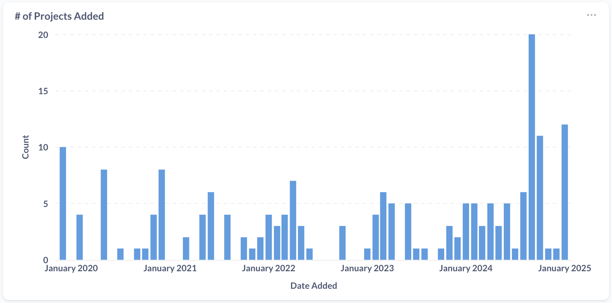

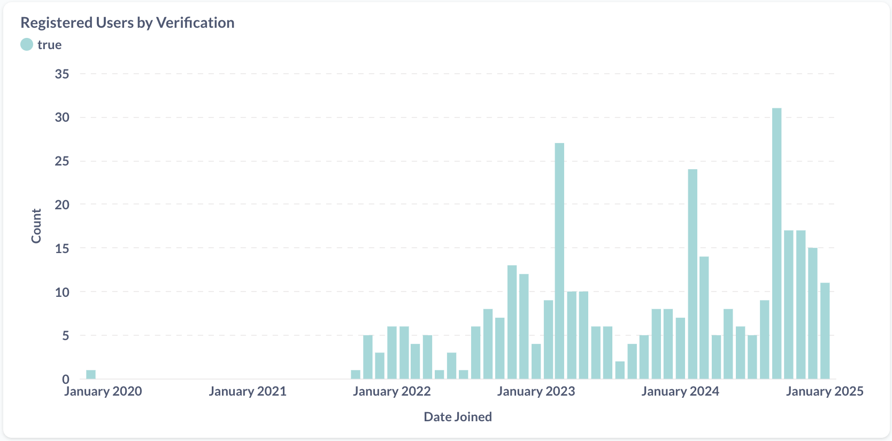

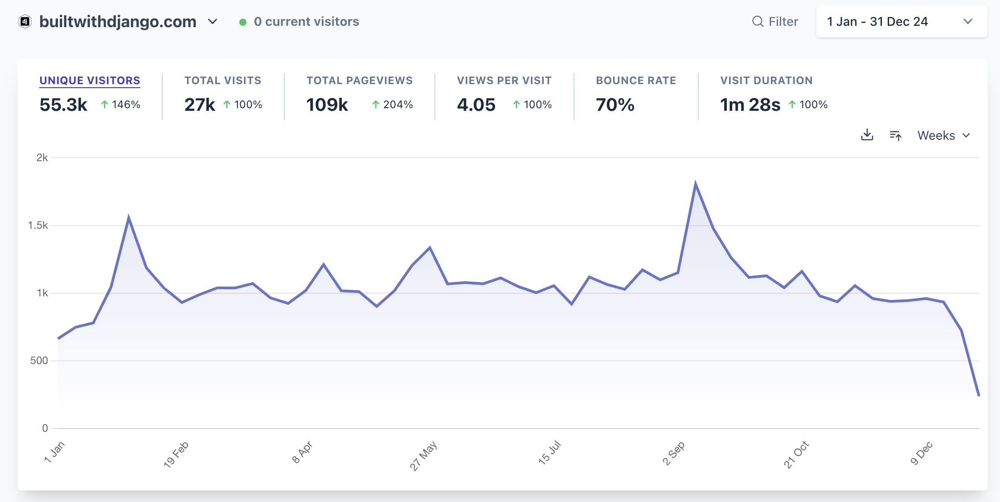

### TJ Alerts

```
==================================================
💼 JOB POSTING STATISTICS 2024
==================================================

📊 CORE JOB METRICS
Total Jobs Posted: 4,202
Remote Jobs: 2,588 (61.6% of all jobs)
Onsite Jobs: 1,956 (46.5% of all jobs)

💰 SALARY INFORMATION
Jobs with salary info: 4,202 (100.0%)
Average salary range: $27,281 - $35,463

📅 MONTHLY JOB POSTINGS
------------------------------
January    | ██████████████ 303
February   | █████████████████ 357
March      | ███████████████ 319
April      | ██████████████ 311
May        | ████████████████████ 419
June       | █████████████████ 369
July       | ███████████████████ 404
August     | ████████████████ 341
September  | ████████████████ 337
October    | ████████████████ 355
November   | ███████████████ 335
December   | ████████████████ 352

🔧 TOP 10 MOST IN-DEMAND TECHNOLOGIES
--------------------------------------------------
 1. Python                    |  737 jobs (17.5%)
 2. React                     |  689 jobs (16.4%)
 3. AWS                       |  442 jobs (10.5%)
 4. Typescript                |  371 jobs ( 8.8%)
 5. TypeScript                |  292 jobs ( 6.9%)
 6. Postgres                  |  253 jobs ( 6.0%)
 7. Kubernetes                |  233 jobs ( 5.5%)
 8. Rust                      |  229 jobs ( 5.4%)
 9. Go                        |  207 jobs ( 4.9%)
10. PostgreSQL                |  183 jobs ( 4.4%)

==================================================
🔍 CONFIRMED ALERT SYSTEM ANALYTICS 2024 🔍
==================================================

📊 CORE METRICS
Total Confirmed Alerts: 134
Currently Active Alerts: 104
Email Notifications Sent: 1,965

👥 USER ENGAGEMENT
Registered Users: 37 (27.6%)
Non-registered Users: 97 (72.4%)

📈 PERFORMANCE METRICS
Unsubscribe Rate: 22.4%

📅 MONTHLY GROWTH
------------------------------
January    | ████ 8
February   | █████ 9
March      | ██████ 11
April      | █████ 9
May        | ████████████████████ 36
June       | ██████████████████ 33
July       | ████ 8
August     | ██ 5
September  | ██ 4
October    | ██ 4
November   | █ 3
December   | ██ 4

🎯 TOP 10 MOST WATCHED TECHNOLOGIES
--------------------------------------------------
 1. React Native              |   15 alerts (11.2%)
 2. React                     |   13 alerts ( 9.7%)
 3. Python                    |   11 alerts ( 8.2%)
 4. Django                    |   10 alerts ( 7.5%)
 5. PHP                       |    9 alerts ( 6.7%)
 6. C#                        |    9 alerts ( 6.7%)
 7. Elixir                    |    7 alerts ( 5.2%)
 8. Python/Django             |    4 alerts ( 3.0%)
 9. Ruby on Rails             |    3 alerts ( 2.2%)
10. Go                        |    3 alerts ( 2.2%)

```

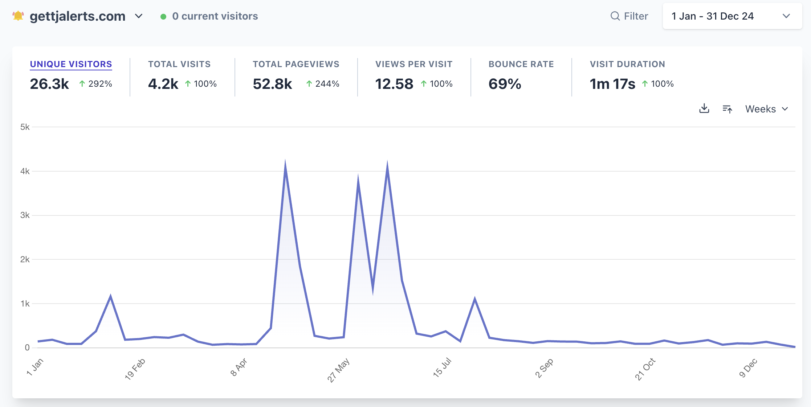

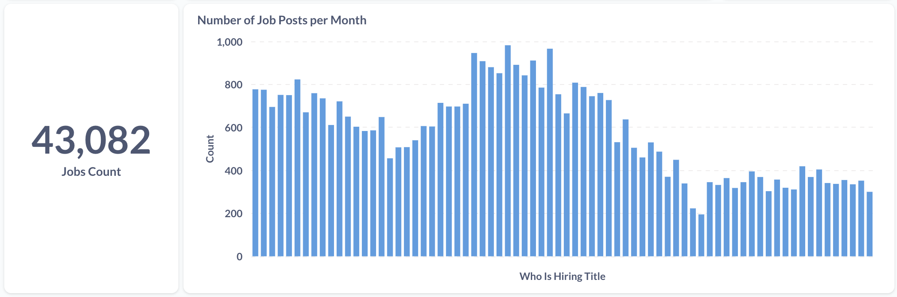

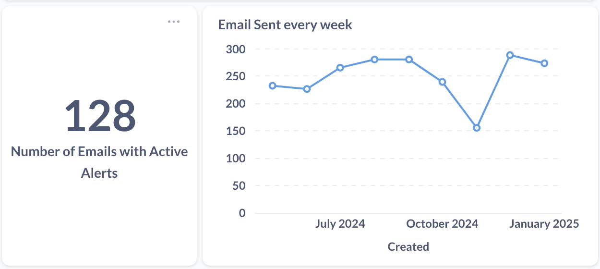

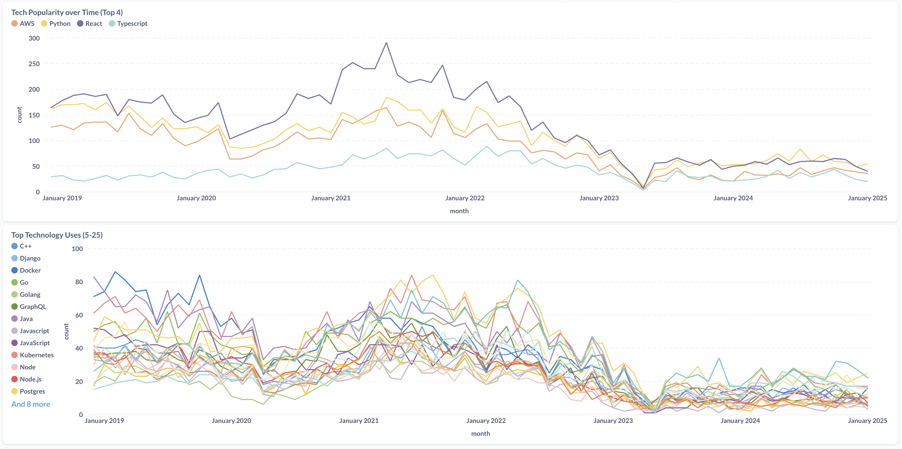

### SEO Blog Bot

The images here include the full month of January in 2025. Sorry, got a little lazy there.

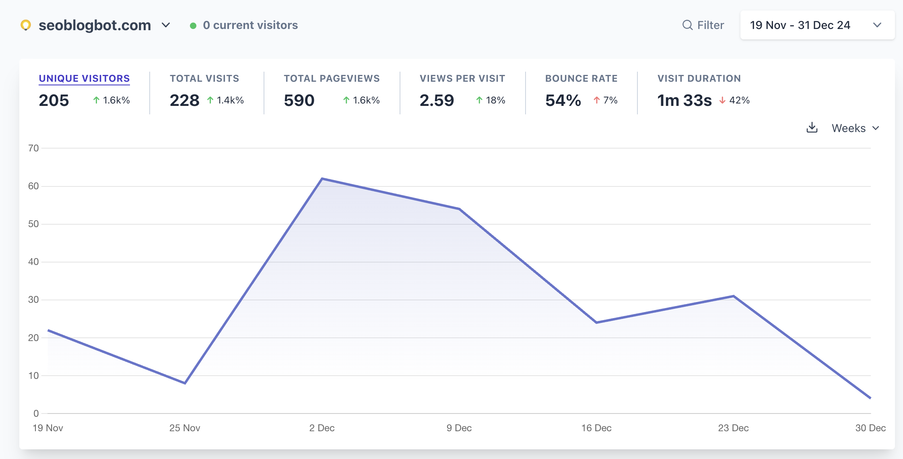

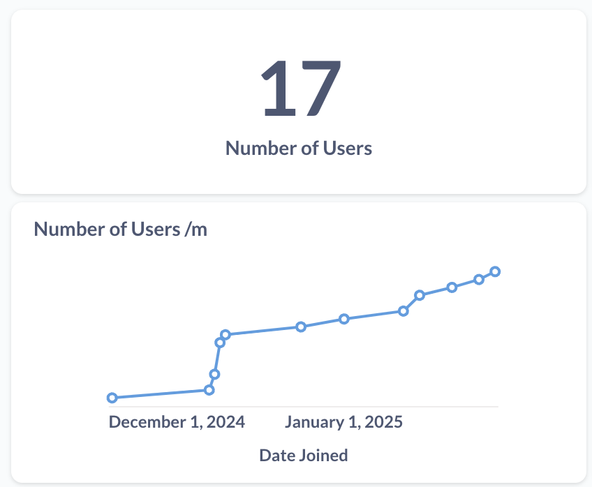

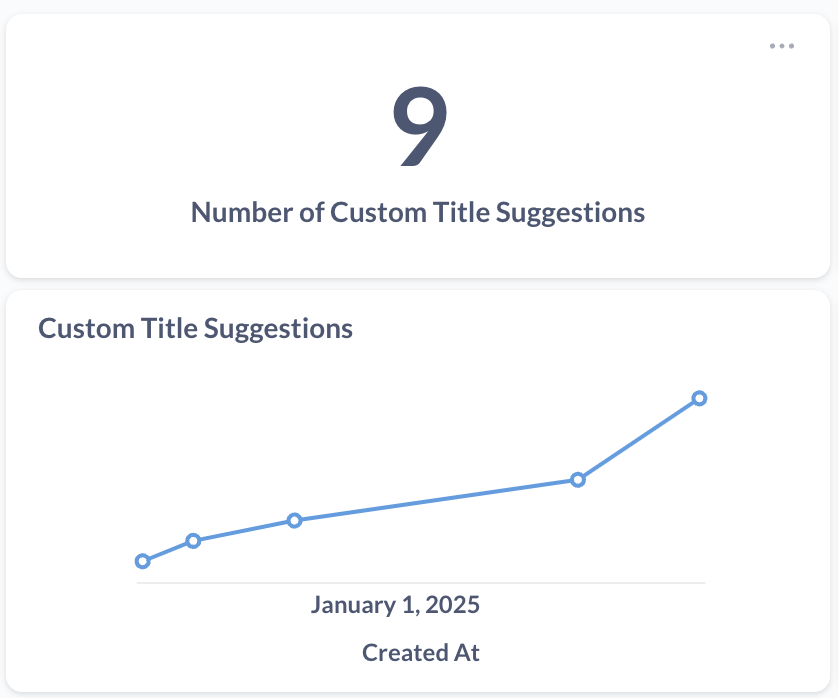

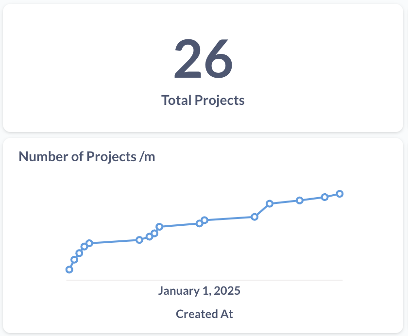

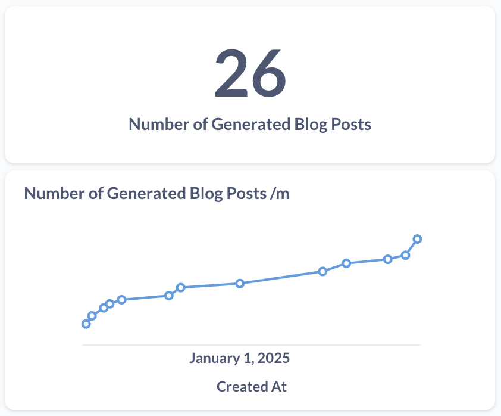


### Notes

```
2 Tag/Concept Notes Created
185 Content Notes Created
422 Total Notes Created

# Notes by Folder Distribution
Shows where you're creating most of your notes

| Folder                         | Count |
|-------------------------------|-------|
| notes/archive                 |     2 |
| notes/inbox                   |     8 |
| notes/ongoing                 |    11 |
| notes/ongoing/archive         |     1 |
| notes/ongoing/to_post         |     2 |
| notes/recurring/daily         |   142 |
| notes/recurring/yearly        |     3 |
| notes/writings                |     6 |
| notes/writings/done           |     6 |
| notes/zettelkasten/literature |     4 |
| people                        |     3 |
| sources/Readwise              |   229 |
| tagnotes                      |     2 |

# Linking Statistics
Shows which notes are most connected to others

| File                                                                                   | Outgoing Links | Incoming Links | Total Connections |
|----------------------------------------------------------------------------------------|----------------|----------------|-------------------|
| Oh Crap! I Have a Toddler                                                              |             30 |              1 |                31 |
| The Algebra of Wealth                                                                  |             28 |              2 |                30 |
| How to Do Great Work                                                                   |             28 |              0 |                28 |
| robotics is sort of happening in our peripheral vision now 202406271748                |             25 |              1 |                26 |
| Сравнительные Жизнеописания                                                           |             20 |              0 |                20 |
| the imperfect project you actually complete is worth more than the perfect project...  |             19 |              1 |                20 |
| having a social component in a place where you post can be a big boost... 202411020830 |             17 |              1 |                18 |
| The Beginning of Infinity                                                              |             16 |              0 |                16 |
| courses I own                                                                          |             14 |              0 |                14 |
| browser extensions allow and encourage users to modify the apps... 202406271853        |             13 |              1 |                14 |

# Monthly Creation Patterns
Shows your note creation patterns by month

| Month    | Notes Created |
|----------|---------------|
| 2024-01  |           48 |
| 2024-02  |           27 |
| 2024-03  |           23 |
| 2024-04  |           26 |
| 2024-05  |           30 |
| 2024-06  |           34 |
| 2024-07  |           41 |
| 2024-08  |           44 |
| 2024-09  |           33 |
| 2024-10  |           36 |
| 2024-11  |           48 |
| 2024-12  |           32 |

# Weekly Activity Patterns
Shows which days of the week you're most active

| Day       | Notes Created |
|-----------|---------------|
| Tuesday   |           85 |
| Wednesday |           84 |
| Monday    |           66 |
| Thursday  |           61 |
| Friday    |           56 |
| Saturday  |           43 |
| Sunday    |           27 |
```

### Writing

I got a little lazy here. There is much more I can get, like character count, but I'll leave it until next year.

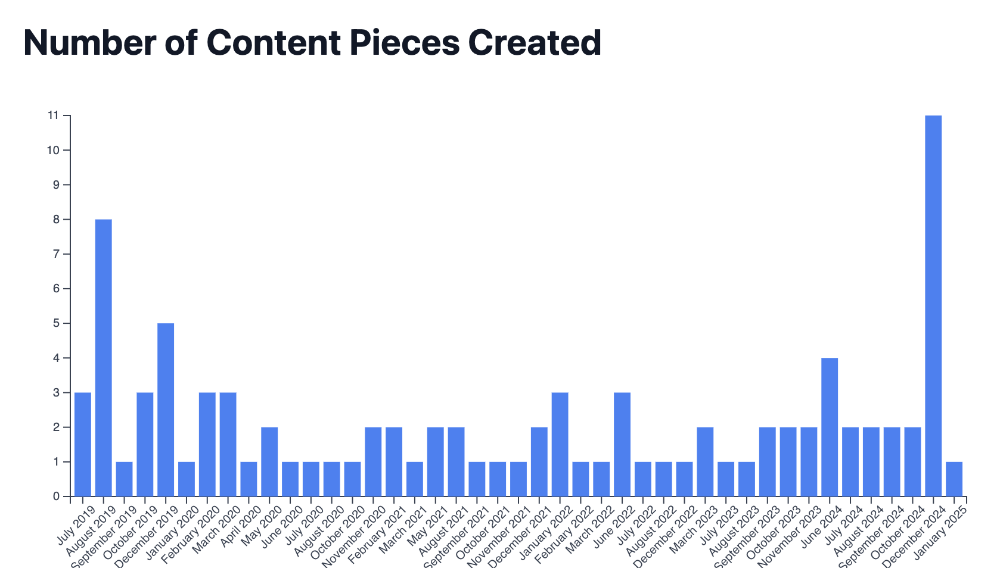

## Family

The biggest event that happened with our family is that we had to temporarily move back to Russia for some time. This was a very annoying disturbance to our way of life. We had a rhythm, Tanya and I, dealing with life, work and a year old son. The moving process was hectic, but we got it done.

Moved all our belongings in the storage, sold our car, bought airplane tickets and packed 9 bags to travel back with us.

The trip went much better than expected. All of our bags went to the final destination and we got a long layour after our first flight, which allowed us to sleep. Thank god Theo decided to sleep with us.

This was in February, so we spent most of the year in Russia. First 2 months we lived with my mom. She helped us, while we slowly got back up on our feet which we are very grateful for. My sister Aida was very helpful too, the way that they bonded with Theo still means a lot to me.

Of course when you have a 1 year old most of the year will be about him. He made a lot of progress this year, which made Tanya and I very happy. I'm not going to list it all, cause the list is pretty generic for babies this age. We and I are happy to see how is growing up.

This means that we didn't get to spend too much quality time with my wife, alone. But, we are trying every chance we have. Work in progress.

All in all this has been a great year. Yes, some bad moments, bad fights, but I'm very happy about the family I have and the direction we are going in.


## Readwise

This was my first full year at Readwise. I joined in November 2023. This has been an amazing year. Got to work on so many different parts of the project. I worked both on Readwise and Reader. Bother mobile and web. Frontend and backend. App and Analytics. The diversity of skills required on my part has never been so broad. For a person whose life goals to be a highly skilled generalist this is a dream come true.

People I work with are amazing. To be honest, I have always been lucky with people I work with. In my short period of working at 5 companies people have always been great, smart and kind. One thing that Readwise beats all those companies in is that I get to know all the people I work for. In my previous experience of working for larger companies I only got to work with people in my department. Here, though, with a full team of 23 people, I know each single person. People from Finance, CX, Engineering, Business Operations, everyone.

I got to go to Curacao on an offsite to meet personally with the team (since we are a remote team). It was amazing. Even the 36+ travel time to that location did not take away from the experience. Though I've got to admit, I love flying, especially when I get to do it alone (without my wife and son 🙈).

Here are some professional highlights from working at Readwise:
- Started using and valuing logs a lot. Became much better at NRQL queries to use as app usage analytics.
- Gained a much better understanding (and appreciation of complexity) of models and data. It ain't easy parsing web content reliably.
- Here are some projects I worked on:
	- Allow users to customize their import emails
	- Advanced email subscriptions management (sub/unsub)
	- Data Analytics on large, large data for various questions people had. Those could be revenue related or app usage related. When you have a lot of users and a lot of data, it is much more fun to ask questions. Though at the same time hard to answer them too.
	- Better internal tracking of user journey.
	- I've worked a lot on our Export and Import integrations. This is not the code I wrote. So this is less fun, I just have to make sure to fix bugs and monitor nothing breaks. Since each integration is a separate module it takes a lot of time to learn and understand, which makes my work much slower makes me conscious a lot.

## Personal Work

I'm the type of person that always thinks he is not doing enough. The Impostor Syndrome is my good old friend by now. This Annual Review and any type of long term review is extremely useful to cope with that nasty thing.

Day to day you think that not much is done, then you zoom out and you see that you actually made some good progress. This is a summary of the progress I made this year.

This has been a good year. Not the whole year, though. I was able to do some work on my existing projects, but it all exploded in Fall. Tanya and I found a wonderful daycare for Theo which added 3-4 additional hour in my day. And once that happened I went nuts.

First project I decided to make was a replacement for ogi.sh, which is a programmatic OG-image generator. It was closed by the creator and I decided to whip up a quick version of my own. While doing that I spent a lot of time updating my cookiecutter for django based Saas projects. This second part actually took a while, but the ROI was amazing.

Write after getting OSIG stable, I started working on Statushen. For some reason I thought it would be a profitable project. But to be honest with you I was so in the zone while coding it, I actually can't remember whether I launched it or not. I started using it for all my projects as a Stasus page for my services, but it didn't get much traction. Well, the infrastructure is there and maybe I can work on it in 2025, we will see. Needless to say, this project helped me update Saas Starter Kit even further, which brings me to the next point.

The next project I decided to make was inspired by John Rush. He was building seobotai, which I thought was very cool. I sort of stole the idea and decided to put a spin on it. I'm currently using it for all my projects, but not nearly enough. I think this is the project that has the most potential. There are already a couple of trial users, even without me launching it officially. I definitely need to think about this product more in 2025. There is a lot I can do I think.

One notable thing I have done with one of my existing projects is adding advertising more heavily on Built with Django. I have been reaching out to various companies in the attempt to get some server funding. It worked Ramy from Hovercode decided to pay for a sponsored post and reported back with good results even providing me with a testimonial.

One last thing I want to mention here is that this year has had another big event in my professional life. I have finally made my first business acqusition. I bought Is It Keto from Michael Lynch, who made this process a dream come true. I wrote more about it here.
