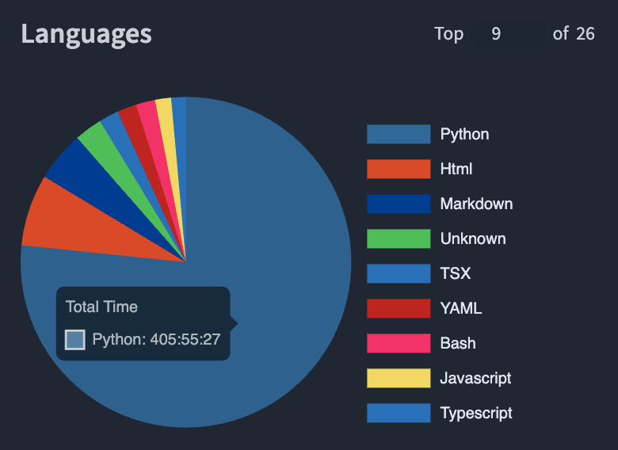

This year, I decided to wing my annual review. Still no concrete strucutre. Just writing it bit by bit when inspiration strikes.

## Events based on memory
Good reflection exercise. What comes first to your head to get the events that were the brightest. Obvoulsy this can be a liottle biased since you'll get events that were the latest.

- Went to Italy with Readwise.
- Stayed in Rome with Tanya (without Theo).
- Went to Brazil with Tanya and Theo for 2 months to visit Tanya's parents.
- Annual Review at Readwise that didn't go too well.
- USA Visa issues based on poor performance on company lawyers. Couldn't go to USA offsite.
- Theo turned 2.
- Decided to get the Spanish Nomad visa.
- Rebranded TuxSEO twice. SEOBlogBot -> Marketing Agents -> TuxSEO
- Theo started going to Kindergarten again.
- Created Cleanapp based on Justin Duke's request.
- Tried creating an app with Alan, but didn't go anywhere in 2025. Maybe we can do this in 2026?
- Finally have setup a more or less stable way of transferring funds from USA to Russia. Such a pain in the ass.
- Launched TuxSEO everywhere I could.

## Events based on Photos
Photos are great captures of memories and reflecting on them is a great to remind yourself what happened last year. Excluding things that I talked about above.

- Theo's successful potty training. You might ask, why I thought of it, from watching the photos... Well, don't ask.
- F1 in Baku. (Crazy how that did not occur to me in the first section. This was a big whole family trip)
- We did a bunch of "2-of-us" travelling with Tanya this year: Rome, Rio, Buenos Aires.
- open Helicopter ride in Rio was fun

## Books I read

Legend:
- ✅ - Recommend
- ❌ - Do not Recommend
- ? - Can't be sure

| Title | Author | Genre | Words Read | Status | Recommendation |
|---|---|---|---:|---|---|
| The Secret of Secrets | Dan Brown | Fiction (Thriller) | 216,655 | finished | ✅✅ |
| The Last Templar | Raymond Khoury | Fiction (Thriller) | 128,003 | finished | ❌❌ |
| Hunt, Gather, Parent | Michaeleen Doucleff | Parenting | 109,561 | finished | ✅✅ |
| Пиши, сокращай Как создавать сильный текст | Максим Ильяхов | Writing / Communication | 86,590 | finished | ✅ |
| Oh Crap! Potty Training | Jamie Glowacki | Parenting | 82,811 | finished | ✅ |
| 80/20 Sales and Marketing | Perry Marshall | Business (Sales/Marketing) | 78,172 | finished | ✅ |
| Start Small, Stay Small: A Developer’s Guide to Launching a Startup | Rob Walling | Business (Startups) | 58,337 | finished | ✅ |
| The Almanack of Naval Ravikant: A Guide to Wealth and Happiness | Eric Jorgenson | Self-development / Wealth | 49,064 | finished | ✅ |
| Getting Real | 37signals | Tech / Product | 32,008 | finished | ✅✅ |
| The 22 Immutable Laws of Marketing | Al Ries | Business (Marketing) | 32,294 | finished | ✅ |
| Growth Levers and How to Find Them | Matt Lerner | Business (Growth) | 26,761 | finished | ❌ |
| How to Live | Derek Sivers | Self-development | 22,439 | finished | ✅✅ |
| Book 7: Incorporating and investing ($8k/month, early 2022) | Alex West | Business (Entrepreneurship) | 16,020 | finished | ❌ |
| Вишнёвый сад | Антон Чехов | Fiction (Play) | 12,557 | finished | ❌❌ |
| Book 5: Into the wild ($5k/month, mid 2021) | Alex West | Business (Entrepreneurship) | 10,769 | finished | ✅ |
| A Skill Called Luck | Jakob Greenfeld | Business / Self-development | 10,638 | finished | ✅ |
| Шинель | Николай Гоголь | Fiction (Classic) | 10,025 | finished | ✅ |
| Book 6: Next lever of growth ($8,000/month, late 2021) | Alex West | Business (Entrepreneurship) | 9,780 | finished | ✅ |
| Unf*ck Your Sales | Jakob Greenfeld | Business (Sales) | 8,995 | finished | ✅ |
| Book 1: Screaming into the void (Zero to $100/month) | Alex West | Business (Entrepreneurship) | 8,840 | finished | ✅ |
| Book 3: Learning through scars | Alex West | Business (Entrepreneurship) | 8,523 | finished | ✅ |
| Book 2: Breaking through the ceiling | Alex West | Business (Entrepreneurship) | 8,331 | finished | ✅ |
| Господин из Сан-Франциско | Иван Бунин | Fiction (Classic) | 6,956 | finished | ✅ |
| Чем люди живы | Лев Толстой | Fiction (Classic) | 5,895 | finished | ✅ |
| Book 4: Burning the boats ($4k/month, early 2021) | Alex West | Business (Entrepreneurship) | 4,589 | finished | ✅ |
| Outlive: The Science and Art of Longevity | Bill Gifford | Health / Longevity | ? | in progress | ✅ |
| The King James Version of the Bible |  | Religion | ? | in progress | ? |
| Сравнительные жизнеописания | Плутарх | History / Classics | ? | in progress | ✅ |
| Война и мир | Лев Толстой | Fiction (Classic) | ? | in progress | ✅✅ |
| Опыты: Книга первая | Мишель Монтень | Philosophy | ? | in progress | ? |
| Dialogues | Seneca | Philosophy (Stoicism) | ? | in progress | ✅ |
| The 4-Hour Body | Timothy Ferriss | Health / Fitness | ? | in progress | ✅✅ |
| Unreasonable Hospitality | Will Guidara | Business (Service / Hospitality) | ? | in progress | ✅ |
| Traction | Gabriel Weinberg | Business (Marketing) | ? | in progress | ? |
| Scaling Fast | Swizec Teller | Tech / Engineering | ? | in progress | ✅ |
| Demand-Side Sales 101 | Bob Moesta | Business (Sales) | ? | in progress | ? |
| Main Street Millionaire | Codie Sanchez | Business / Investing | ? | in progress | ✅ |
| The Algebra of Wealth | Scott Galloway | Money / Wealth | ? | in progress | ✅ |
| Alpha Trader | Brent Donnelly | Money / Trading | ? | in progress | ? |
| The Million-Dollar, One-Person Business, Revised | Elaine Pofeldt | Business (Entrepreneurship) | ? | in progress | ✅ |
| The Mom Test | Rob Fitzpatrick | Business (Customer Research) | ? | in progress | ? |
| The Cold Email Manifesto | Alex Berman, Robert Indries | Business (Sales) | ? | in progress | ✅ |
| Product-Led Growth | Wes Bush | Business (Product/Growth) | ? | in progress | ? |
| Indexing Beyond The Basics | Tobias Petry | Tech / Databases | ? | in progress | ✅ |
| Full-Stack Tao | Alex Kondov | Tech / Engineering | ? | in progress | ? |
| Ultimate Guide to Link Building | Garrett French | Business (SEO) | ? | in progress | ? |
| The Sweaty Startup | Nick Huber | Business (Entrepreneurship) | ? | in progress | ✅ |
| Write Useful Books | Rob Fitzpatrick | Business / Writing | ? | in progress | ✅ |
| Born Reading | Jason Boog | Parenting / Education | ? | in progress | ❌ |
| Man's Search for Meaning | Viktor Frankl | Psychology / Memoir | ? | in progress | ✅ |
| The Narrow Road | Felix Dennis | Business / Wealth | ? | in progress | ✅ |
| Obviously Awesome | April Dunford | Business (Positioning/Marketing) | ? | in progress | ? |
| SPQR: A History of Ancient Rome | Mary Beard | History | ? | in progress | ✅ |
| Весь Пушкин для детей (сборник) | Александр Пушкин | Fiction (Poetry) | ? | in progress | ✅ |
| Гаргантюа и Пантагрюэль | Франсуа Рабле | Fiction (Classic/Satire) | ? | in progress | ✅ |
| Размышления | Марк Аврелий | Philosophy (Stoicism) | ? | in progress | ✅ |

## Projects I worked on

- TuxSEO (prev. SEO Blog Bot, Marketing Agents)
- Cleanapp (.dev)
- Mocoge
- Ask HN Digests
- Talent Leads
- TJ Alerts
- Built with Django
- OSIG

## Data

### Obsidian
- Total Notes created in 2025: 577
- Journal notes created in 2025: 292
- Days with at least 1 new note (2025): 278
- Weeks with at least 1 new note (2025): 52
- Max notes created in one day (2025): 11
- Outbound links from 2025-created notes: 2505
- Avg outlinks per 2025 note: 4.34
- Orphans (created 2025, 0 inlinks): 430
- Dead-ends (created 2025, 0 outlinks): 271
- Max inlinks (most linked note): 669
- Total tags used (2025-created notes): 7

### Writing

- 16 pieces of content published on my site.
- Top read/views pages
	- How to Read a Book - book review (508 views)
	- Create Smarter & Better Git Commits with AI (380)
	- The Way of Superior - book review (349)
	- Happy Sleeper - book review (301)
	- Managing Django with Poetry (293)

### Coding

- 555 hours spent in my IDE (320 in Readwise)
- Besides work, worked on 13+ products
- Languages I used most

## AI Chats

I use Typingmind to do most of my AI chats. As part of my workflow I regularly export the data (chats, messages, etc.) and load it into local SQLite db. This makes it relatively easy to analyze the conversations I've had. Here is the result.

**Django**
- Lots of Django ORM work: counts/group-bys, index usage, JSONField queries, EXPLAIN/ANALYZE, query performance tuning
- Frequent model-layer refactors: moving logic from views/scripts into model methods; signal handler simplification
- Migration and schema safety: moving models between apps, related_name clashes, data migration failures, implicit indexes
- Building product features: webhooks, integrations, background jobs, admin bulk actions, auth/account models

**Async tasks**
- Heavy focus on task execution correctness: mutex/lock issues, pickle deserialization failures, QueueOnce behavior
- Operational debugging: session timeouts, task status tracking, worker memory/404 incidents, SoftTimeLimit handling
- Better observability for jobs: emitting scheduled/finished logs, adding context to task logs, naming queued tasks
- Evaluating tooling choices: “best Django library for async tasks”, Celery vs Django-Q2 tradeoffs

**Data & analytics**
- Building product analytics queries: DAU/session metrics, cohort breakdowns, event pivots, weekly vs daily aggregation
- Operational reporting: export failure rates, status checker scripts, reader document/source counts
- Query optimization themes: pre-aggregated daily models, index usage verification, formatting results into tables
- Mixing app DB + warehouse: joining user/profile metadata with event/referral/email-send datasets

**Infrastructure & DevOps**
- Docker/Compose troubleshooting: hostname resolution, network conflicts, entrypoint issues, TLS handshake timeouts
- Postgres administration: recovery mode, disk space failures, collation mismatch, pg_stat_statements, publications/users
- Hosting/ops platforms in the mix: CapRover, Render blueprints, Fly.io templates, NGINX upstream problems
- Self-hosted tooling experiments: SigNoz, Huginn, Strapi, Paperless-ngx, registries and service wiring

**Integrations & automation**
- Content pipeline integrations: Readwise↔Notion exports, Kindle/Instapaper/Pocket imports, Google Docs processing
- API edge cases everywhere: auth expiry, rate limits (429), token caches/resets, parsing/validation of messy inputs
- Zapier app/webhook design: event types, tag transformations, publishing requirements, REST hook payloads
- Payments & identity: Stripe/dj-stripe webhook handlers and migrations; Allauth social providers and SSO decisions

**AI-assisted content & marketing systems**
- Designing prompt “products”: SEO title generators, content templates, summarization prompts, anti-placeholder safeguards
- Agent/workflow engineering: PydanticAI/DSPy comparisons, multi-agent system prompts, execution contexts
- Building distribution mechanics: content idea buttons, blog UI tweaks, cold email campaign systems for TuxSEO
- Tooling research: AI research/blog generators, “deep research” patterns, automated reporting pipelines

**Personal growth, planning, and career/work well-being**
- Structured reflection: annual reviews, weekly activity summaries, “Friday wins”, resume condensation and work summaries
- Career tension themes: burnout, feedback anxiety, shipping without review, “normal job” vs side project ambition
- Goal-setting and systems thinking: SMART goals, simplicity/dead code philosophy (“Getting Real” inspired threads)
- Life direction exploration: “AI profile summary”, balancing independence vs asking for support

**Travel, culture, and everyday life**
- Deep travel planning: Rome/Florence/Rio/Brasília/Baku itineraries, restaurant selection, tours, logistics
- History/literature/art curiosity: War and Peace/Durant/Great Books, Baroque sites, museum/architecture facts
- Food/cooking experiments: slow-carb/keto meals, recipes, kitchen tools, tea/supplements
- Family/health practicalities: toddlers’ sleep/illness questions, posture, medical report interpretation, small-life troubleshooting

## TypingMind Usage

**Yearly Chat Summary (2025)**

- **Chats**: 1,151
- **Total messages**: 4,935
- **Your messages**: 2,409
- **Avg messages per chat**: 4.3
- **Avg your messages per chat**: 2.1
- **Total cost (USD)**: $107.80
- **Avg cost per chat**: $0.09
- **First chat date**: 2025-01-01
- **Last chat date**: 2025-12-31

**Chats by Model**

| Model | Chats |
| --- | --- |
| Claude Sonnet 4 | 311 |
| Perplexity Sonar Pro | 218 |
| Claude 3.5 Sonnet | 177 |
| Claude 3.7 Sonnet | 156 |
| Claude Sonnet 4.5 | 139 |
| Gemini 2.5 Flash | 45 |
| GPT-5.1 | 34 |
| GPT-5 | 14 |
| GPT-5 Mini | 10 |
| unknown | 9 |
| Perplexity Deep Research (High Reasoning) | 9 |
| GPT-5.2 | 8 |
| GPT-5 Pro | 8 |
| Gemini 2.0 Flash | 6 |
| Claude Opus 4 | 2 |
| Gemini 3 Pro Image | 1 |
| Gemini 2.5 Pro 06-05 | 1 |
| O1 | 1 |
| Gemini 2.5 Pro | 1 |
| Gemini 2.5 Flash Image | 1 |

**Cost by Model (USD)**

| Model | Cost |
| --- | --- |
| Claude 3.5 Sonnet | $31.68 |
| Claude Sonnet 4.5 | $24.25 |
| Claude 3.7 Sonnet | $15.42 |
| Claude Sonnet 4 | $15.22 |
| GPT-5.1 | $5.85 |
| Perplexity Sonar Pro | $5.11 |
| GPT-5 Pro | $4.39 |
| GPT-5 | $1.60 |
| O1 | $1.37 |
| Perplexity Deep Research (High Reasoning) | $0.86 |
| Claude Opus 4 | $0.72 |
| Gemini 2.5 Flash | $0.47 |
| GPT-5.2 | $0.32 |
| Gemini 2.5 Pro | $0.29 |
| Gemini 3 Pro Image | $0.14 |
| GPT-5 Mini | $0.08 |
| Gemini 2.5 Flash Image | $0.03 |
| Gemini 2.5 Pro 06-05 | $0.02 |

**Tokens by Model (from chats)**

| Model | Tokens |
| --- | --- |
| Claude 3.5 Sonnet | 8,610,851 |
| Claude Sonnet 4.5 | 4,684,646 |
| GPT-5.1 | 3,969,703 |
| Claude 3.7 Sonnet | 3,671,956 |
| Claude Sonnet 4 | 3,117,938 |
| Gemini 2.5 Flash | 1,069,685 |
| Perplexity Sonar Pro | 799,055 |
| GPT-5 | 686,558 |
| Gemini 2.0 Flash | 507,204 |
| Gemini 2.5 Pro | 206,751 |
| Perplexity Deep Research (High Reasoning) | 117,887 |
| GPT-5 Pro | 94,557 |
| GPT-5 Mini | 76,611 |
| GPT-5.2 | 72,203 |
| O1 | 37,395 |
| Claude Opus 4 | 17,254 |
| Gemini 2.5 Flash Image | 6,723 |
| Gemini 2.5 Pro 06-05 | 5,048 |
| Gemini 3 Pro Image | 2,536 |

**Messages by Role**

| Role | Messages |
| --- | --- |
| assistant | 2,442 |
| user | 2,409 |
| tool | 84 |

**Message Model Usage**

| Model | Messages | Tokens |
| --- | --- | --- |
| claude-sonnet-4-0 | 1,210 | 2,663,215 |
| claude-3-5-sonnet-20241022 | 999 | 6,104,062 |
| claude-sonnet-4-5 | 731 | 3,660,523 |
| claude-3-7-sonnet-latest | 731 | 2,994,495 |
| 7b57395c-bfdb-4f66-bd46-d6a82690e68d | 662 | 588,798 |
| gpt-5.1 | 200 | 3,863,616 |
| gemini-2.5-flash | 162 | 850,462 |
| gpt-5 | 80 | 571,312 |
| gpt-5-mini | 31 | 59,021 |
| d5fec15d-fb78-4b01-ba7c-0e17e9bf8d5a | 29 | 15,184 |
| gpt-5.2 | 25 | 50,879 |
| aeb0eb37-c890-4e59-bbf4-04d02fd24f75 | 18 | 59,934 |
| gpt-5-pro | 17 | 218,016 |
| gemini-2.5-pro | 12 | 203,055 |
| gemini-2.0-flash | 12 | 493,644 |
| gemini-2.5-flash-image-preview | 4 | 6,723 |
| claude-opus-4-0 | 4 | 8,595 |
| o1 | 2 | 5,396 |
| gemini-3-pro-image-preview | 2 | 1,924 |
| gemini-2.5-pro-preview-06-05 | 2 | 2,729 |
| 89b723a6-ce8f-4a45-82d0-788d140c0966 | 2 | 210 |

**Chats by Month**

| Month | Chats |
| --- | --- |
| 2025-01 | 77 |
| 2025-02 | 121 |
| 2025-03 | 53 |
| 2025-04 | 51 |
| 2025-05 | 51 |
| 2025-06 | 58 |
| 2025-07 | 111 |
| 2025-08 | 142 |
| 2025-09 | 133 |
| 2025-10 | 156 |
| 2025-11 | 96 |
| 2025-12 | 102 |

## What didn't go well
- No meaningful (recurring) revenue on any of my projects.
- Bad review at Readwise.
- Need to spend more quality time with my wife.

## What went well
-

## Notes

This came to me after entering F1 in Baku bullet point in events based on photos. I think my brain does a great job in blocking negative memories from my recall, which is why I have a tendency to focus on the positives and trying to make events positive all the time. Maybe that is how most people brain's work. I wonder what that means and what lessons can be learnt from this.