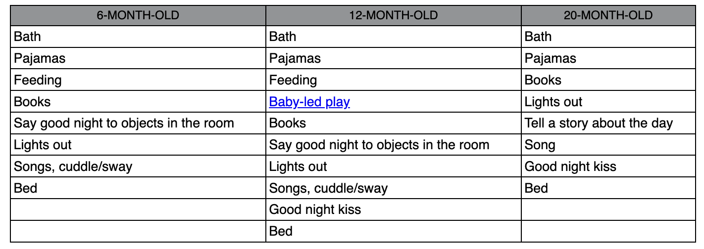
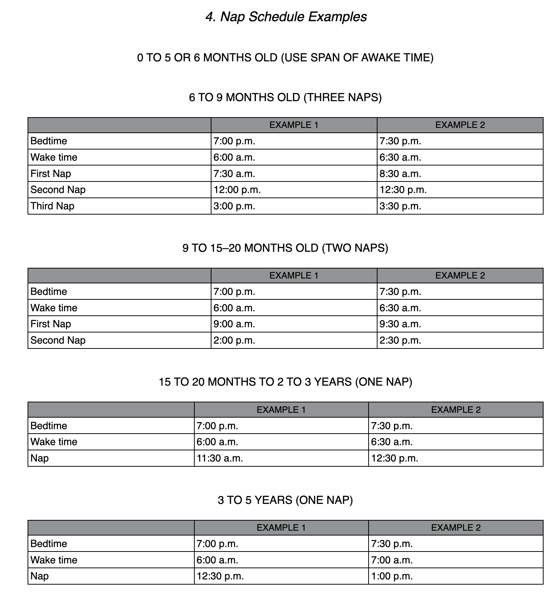

## Summary

- Overhelping babies and children to sleep can hinder their natural sleep abilities and development.
- Consistency and creating patterns are important for babies and children to relax and sleep well.
- Well-rested babies and children are emotionally balanced, healthier, more creative, and have better cognitive abilities.

These are the arguments laid out to convince you to follow their method. Below I will describe the method they provide for kids 6 months and older. They do also have a chapter for younger kids, but I skipped it, since it was irrelevant to me.

**The Sleep Wave method** is going to be your weapon of choise. Here is how it works:
- Establish a night time ritual. Here are some examples from the book

My wife and I tried to do a full 6 month one, but then reduced it down a little. Here is what we do:

1. Dinner (solid foods) at ~6pm
2. Bath until about ~7pm
3. Pajamas
4. A little Breast Milk
5. "Songs and Lullabies" if my wife putting him to sleep, and saying good night to objects if I'm putting him to sleep.
6. Key Phrase: "Mom and Dad loves you very much. We are right here, next door. Have some rest and when you wake up we will play". This can be anything that you want.

This is the first portion. Next things can go 2 ways. Your baby sleeps (great!) or your baby screams. If the former, nothing for you to do, just enjoy life. If the latter, here is what you do:

1. Go into your baby's room. Don't go close to him, just enter and close the door behind you (not all the way).
2. Say the key phrase that you came up with earlier.
3. Exit.

That's it. With this method, your baby will be a pro sleeper in no time. There are some phsycological difficulties for parents to let their baby cry. Authors cover this too. However these arguments didn't really help my wife. In the "My Thoughts" section I will share what helped her. But here is what authors have to say about this:

- The Sleep Wave method requires consistency and may take time for the baby to adjust and develop their sleep abilities.
- Follow this path religisouly and don't cave in to your babies screams.

Here are some Nap Schedule Example:

## My Thoughts

This book is great. In reality, this could be described in a blog post or even a tweet, but that doesn't matter. If you have a baby that is at least 4 months old, you should give it a read. I read it in 4-5 days, even though I'm generally a slow reader.

**Dealing with Screams**
I personally didn't have an issue with my son screaming his lungs out (yes, sounds horrible, but hear me out). I just knew how much we love him and how happy his life must be during the day. We do everything for him. I concluded that those screams and cries are not from pain or suffering, they are just tears of change. People don't like to change, but they must.

My wife, was crying her eyes out every time she had to wait those 5 minutes of screaming. And nothing that I said calmed her down. Here is what helped her.

One morning she decided to stay with our son while he was "falling asleep". He was in his crib and she was right nex to him. He did not care. He was just looking at the door and screaming hoping that someone would pick him up. If you do this, make sure not to touch or pick up your baby, just be near and try to calm him with your voice.

## Highlights

### Introduction

As parents get stuck in a habit of soothing their little one to sleep, it masks the child’s natural abilities and makes it look as if she can’t sleep on her own. Imagine your child was capable of walking, but you still carried her everywhere instead of letting her practice this new skill!

Logic tells us (and research confirms) that overhelping doesn’t work: When we do things for our babies and kids that they are capable of doing for themselves, it keeps them from developing to their potential (in this case, their sleep potential).

Our methods are based on two logical, research-based ideas. One: babies and little kids need warmth, sensitivity, and a sense that the world is a safe place. Two: they thrive best (and sleep best) when they have structure, routine, and clear expectations. When we work with parents to fix a sleep issue, we always locate the solution in one of these two places. If one of these is missing, a child’s sleep ends up falling short of what she’s developmentally capable of: a 10-month-old baby waking every 1 to 2 hours at night

These parents swear that their child’s not capable or is just a bad sleeper. But when we craft a sleep plan together (as we’ll do in this book), within a week or two their baby is sleeping eleven hours straight, their toddler is taking a beautiful 2-hour nap in her crib, or their child is kissing them good night, grabbing his stuffed animal, rolling over, and falling asleep on his own.

Sleep affects virtually every part of your child’s life. Well-rested babies and kids are emotionally balanced, flexible, and creative; they’re healthier; they think clearly and retain information better. When your child sleeps well, she (and you) feel the ripples of this everywhere. It’s amazing to see how good sleep transforms a family.

### 1. The Happy Sleeper

In one well-known experiment, researchers restricted or extended the sleep of school-age kids by 30 minutes and found that it had a significant impact on their reaction time, attention, and memory. In fact, the difference of 1 hour between the two groups made an impact that was equivalent to two years of academic level.

HERE’S WHAT MAKES A GOOD SLEEPER A warm, attuned parent A pattern of self-soothing Clear family sleep habits A regular schedule that supports natural, biological sleep mechanisms

### 2. The Happy Sleeper Approach

Not only do babies and kids look for patterns, they relax when they find them (and we don’t need to tell you how important relaxing is to sleep). Example of Consistency: Make It Work for You Here is a 6-month-old baby who has detected a pattern that, over time, disrupts sleep: Your baby sleeps on a stroller walk. After a few weeks, she associates the motion of the stroller, curve of the seat, and the sounds of street noise with falling asleep. Now she seems unable to fall asleep in her flat, still, quiet crib. Here’s the same baby, but now she has a pattern that helps sleep: You put your baby in her crib for naps. She associates the motion of turning her head back and forth, the feel of her lovey, and the sounds of a fan in her room with falling asleep. Her room, her crib, and her body movements give her the cues that help her sleep.

When you do something for your child that she is able to do herself, you take away her chance to struggle and ultimately learn. This is why we use the term “attunement” instead of “attachment”—so we can be clear about the goal. To be attuned is to be present and curious, so you can watch your baby and know when to help and also when to give her space. Attuned parents are responsive, while also having clear expectations. They send the message, I’m here with you, and I’m watching, but I know you can do it. You don’t underhelp (by shutting the door and never responding) or overhelp (lying down with your child, rocking or nursing your baby to sleep after she has outgrown this need). When you respond to your child this way, it’s amazing how you’ll see her sleep skills flourish. It’s not because you’ve trained her or tricked her into sleeping well, it’s because she’s able to practice and develop her natural, innate ability to sleep. Pause, observe, and allow your child to find her own way. It can be tough to do, but this is how your baby grows.

Example of Attunement: Toddler Sleep Troubles Here’s a scenario of a toddler who’s having a very common and normal fear of the dark. Night after night, he won’t fall asleep alone in his room and you’re all exhausted. Underhelping: You get frustrated and snap at him, “There’s nothing to be afraid of!” You close the door and don’t go back in, even when he cries. Overhelping: You immediately lie down with your child until he falls asleep, and continue to do this every time he goes to bed. Attuned plan: You and your child practice making the room dark during the day. You talk about how light and dark work and use a flashlight to play and teach about shadows. When it’s time for bed, you give your child’s stuffed animal 10 hugs and kisses and tell him he can get these in the night if he needs them. You say good night and set up 5-minute “check-ons” (see Chapter 5 for the Reverse Sleep Wave).

A typical sleep ladder for a young baby is: 7. Feeding her 6. Picking her up to gently rock until soothed but still awake 5. Jiggling baby in the bed 4. Your touch, patting on the back, rubbing head or tummy, hand over top of the head, and so forth 3. Replacing the pacifier and/or lovey 2. The sound of your voice, talking, singing, shushing 1. Your presence in the room When your baby makes a sound at night, listen first (remember that babies are noisy but they aren’t always telling you they need you). If you decide that your baby isn’t just making normal rustling or squawking noises but is truly saying, “Come in here!” go in and use your Soothing Ladder. Start with number 1 on your list and spend around 15 to 30 seconds on each rung of the ladder until you get to the one that works. Do not feel compelled to go all the way up the ladder each time. You can stop when you notice your baby settling.

### 4. Baby + Toddler (5 Months to 2 Years)

If you’re still putting your baby to bed already asleep (or virtually asleep), this will be the first thing to change in order to improve both her daytime and nighttime sleep. The goal is to put your baby to bed with her as a conscious, knowing participant—without any sneaking out or surprises.

The way your child goes to bed will often determine the quality of her sleep overall. If she goes to sleep with you holding or feeding her, she’s more likely to look around for you when she stirs at night. If she drifts off with her own soothing methods (rolling, wiggling into her favorite position, nuzzling her blankie or lovey, listening to the rain sounds in her room), she can re-create this any time she wakes up at night.

Multiple research studies have found that babies and toddlers who are put into bed already asleep are more likely to wake up during the night and less likely to be self-soothers.

Temperature Keep the room cool, around 65 to 68 degrees Fahrenheit. It may sound chilly, but cooler temperatures are generally better for sleep. If it’s hot and you do not have air-conditioning, use a fan to bring in cooler outside air at night. Don’t overbundle your baby for sleeping.

One of the best ways to help your baby sleep is to set an early and consistent bedtime—between 7:00 and 7:30 p.m. works well for most. When babies and young children stay up later than this, they often become overtired and overstimulated, as levels of stress hormones like cortisol begin to rise in their bodies. This can make them activated, moody, and even less likely to be able to wind down and fall asleep.

Try not to wait until she shows classically “tired” signs like yawning and rubbing her eyes—the optimal bedtime is when your baby is quietly talking, playing, and in a good mood.

Staying up too late can also cause your baby to wake up earlier in the morning (counterintuitive, right?), whereas an early bedtime often begets longer and longer stretches of sleep over time.

Shift the energy in the house (including your own) roughly 30 to 60 minutes before your baby’s bedtime. The older they get, the more children believe that by going to sleep they’re missing out on a party in the living room.

Some babies like to have their bedtime books read to them as they move around and explore the area, rather than in the quintessential side-by-side pose. This can also help them tap into their internal regulation and be in charge of calming down their nervous systems in preparation for sleep.

Setting up new sleep patterns will actually grow your baby’s brain. We know that as babies practice new behaviors, like accessing their self-soothing abilities, they create and begin to strengthen neural pathways in the brain. It’s kind of like creating a new path in a forest: at first, you can barely see it, but as you travel it over and over, it becomes clear and obvious. For babies (and for all of us), those well-traveled pathways become easy and natural to follow the more they are traveled.

Allow her a little awake playtime to get comfortable in her room before starting your sleep plan. You can “dress” the crib in her new room for play, adding a bright sheet, toys, and maybe a mobile, during the day. Have her spend some playtime in there for a few days, both with you nearby and on her own. Redress the crib for sleep and practice putting her down there for naps or the first segment of nighttime sleep. Your child should be familiar with her sleeping place before starting the Sleep Wave.

The reason we call this method the Sleep “Wave” is that we want you, the parent, to imagine yourself as a wave in the ocean. Your repetitive, rhythmic visits, as you roll in and out, are a constant, predictable response for your child. You come and go in a reliable way, and this is key to a healthy attachment. Your baby—who is a natural little scientist, constantly looking for patterns—will learn how you move through this method, always responding to let her know you’re there, but not reverting to doing the soothing for her. Once she detects, tests, and finally trusts your wave pattern, she will relax, turn inward, and access her own self-soothing abilities.

For the fastest learning, we recommend using the Sleep Wave starting at bedtime and continuing to use it in exactly the same way with any nighttime wakings, after any nighttime feedings, and with naps the next day—this gives your baby the most consistent pattern of your response.

1. Put your baby down awake. After bedtime routine, put your baby down drowsy but awake. Give her a pat and say a few words, like “It’s time for sleeping. Mommy’s right outside. I love you,” and leave the room. The statement you say before leaving the room is your “script,” which you will use during your visits if your child is crying. Create your own script and write it down so you and anyone else who puts your baby to sleep is saying and doing exactly the same thing. It’s crucial that it is repeated word for word and not changed or expanded. Good to know: Your baby’s brain has an abundance of “mirror neurons” that absorb emotions from people around her. Approach this process with confidence so that your baby feels good about sleep. Be positive and envision a good outcome—your baby is very sensitive to your physical and emotional state. Your tone should be calm and matter-of-fact. What you’re conveying to your baby is that you believe in her abilities and will respond reliably until she trusts the new pattern. ...

2. The 5-minute check. If your baby starts to cry (really cry—not just fuss, squawk, or whine), wait for 5 minutes. Go into the room, stand either at the door or at the side of the crib (somewhere where your baby can see and hear you), and say your script in a matter-of-fact, confident tone. Your visit should only last as long as it takes to walk in, say your script, and walk out (about 7 to 10 seconds). The check is only to let baby know you’re there. The check is not at all meant to calm her down or help her fall asleep. Don’t soothe, touch, or pick your baby up. Let your baby sense that you give her credit for what you know she’s capable of, and you will continue to do your checks until she trusts the pattern and falls asleep. This is key. Initially, the parent who feels more confident is the best one to do the checks, but you can alternate parents, too. If one parent needs to step outside the house to regroup while the other one takes over and does the checks, that’s okay! It’s not uncommon for babies to protest and cry for 20 to 60 minutes at bedtime, and occasionally this period is longer on the second or third night. Good to know: When the Sleep Wave isn’t working as well as we expect, it’s often because the parent is staying in the room too long, trying to calm, soothe, and help. The paradox is that the well-meaning helping actually makes it much harder for the baby to turn inward. When you deviate from your plan and change your behavior even slightly (by rubbing her back when you go in for one of your checks, for example), your baby then has to spend energy guessing what you’re going to do next, or decoding your behavior and wondering if her protest has resulted in this help from you.

3. The Wave. If she’s still crying, wait another 5 minutes and repeat step 2 exactly. If the crying stops, reset the time to zero and go back in if cries start again and last for 5 minutes. Returning every 5 minutes, if she’s crying, helps your baby detect your pattern. Resist the urge to lengthen the time. Your baby needs your visits to be 100 percent predictable. If your baby is whining or crying intermittently, it can be hard to tell exactly when to go in. Use your best judgment and try to give your baby space if she’s simply talking, grumbling, or mildly protesting, but do your check when she has been truly crying for 5 minutes. Good to know: Sometimes parents tell us, “This doesn’t work. Every time I go in, my baby gets louder and madder.” What we say is that’s exactly what we expect to happen initially. You’ve got to be prepared to “ride the hump.” This is the period, usually the first, second, or third night, when your baby is testing the new pattern and may protest for a long time. The reason we want you to keep the intervals at exactly 5 minutes is that this amount of time is short enough and the frequency always predictable so that there is no risk that your baby moves beyond the protest stage into even the wondering where you are stage. Yes, she’ll get louder and madder, but with the frequency and predictability of your visits, she will still feel safe and secure. You are responding to her, you’re just not responding the way you used to. Once she trusts your new pattern, she will stop protesting, relax, and turn inward to her own very capable sleep abilities. This can take time. Babies are very good little scientists. They like lots of data before they feel certain. We know the Sleep Wave works, because, over the years, we’ve seen it happen for thousands of parents and babies.

4. Good morning. Set a wake-up time that is 11 hours after bedtime. Before this time, you will implement the Sleep Wave for any awakenings your baby has. If your baby is still feeding at night and you wish to wean from one or more feedings, you will need to do so gradually (see here). Anytime after the set wake-up time, greet your baby and make it clear that this is morning. Gently open the blinds, give her a big smile, and sing a little song. Soon her internal clock will register when it’s time to wake up. We don’t recommend waking your baby up in the morning even if 11 hours have passed. Ideally, you’ll let her sleep end naturally. If you’re consistent, most babies figure out the pattern in two to four days and nighttime sleep will improve. Learning often happens more quickly if you apply the Sleep Wave at nighttime and daytime sleep simultaneously. Read more on naps and the Sleep Wave at naptime later in this chapter.

when your baby wakes up for a regular feeding, you can feed her and put her back in bed, awake. Your baby may protest that you’ve put her down awake, but you can again use your 5-minute checks to respond to her until she falls asleep independently again. If she begins to fall asleep during the feeding, don’t let her—pop her right back into her bed, even if the feeding was shorter than usual. (We don’t recommend waking your baby again if she’s already fallen asleep—just try to catch her before she drifts off.)

Evaluate your baby’s nap environment for any unhelpful sleep associations (here). The most common unhelpful ones at naptime are stroller or car rides, parent’s presence, feeding, or rocking to sleep. For the best sleep, your baby should go into her crib or regular sleeping place calm but awake, so that she can grab her blankie, roll around, talk to herself, get comfy, and doze off.

Your mood has a major influence on your baby’s ability to wind down for sleep. If you’re anxious and impatient to get her down, this will be activating to her little brain. Switch yourself into rest mode. Lower your voice and move slowly and carefully in her room while you do her routine. It’s amazing how small, peaceful gestures signal to your baby that sleep is near and elicit a calming response.

6 TO 9 MONTHS OLD (THREE NAPS) EXAMPLE 1 EXAMPLE 2 Bedtime 7:00 p.m. 7:30 p.m. Wake time 6:00 a.m. 6:30 a.m. First Nap 7:30 a.m. 8:30 a.m. Second Nap 12:00 p.m. 12:30 p.m. Third Nap 3:00 p.m. 3:30 p.m. 9 TO 15–20 MONTHS OLD (TWO NAPS) EXAMPLE 1 EXAMPLE 2 Bedtime 7:00 p.m. 7:30 p.m. Wake time 6:00 a.m. 6:30 a.m. First Nap 9:00 a.m. 9:30 a.m. Second Nap 2:00 p.m. 2:30 p.m.

One of the most common issues with using the Sleep Wave is that parents think it’s a onetime fix.
